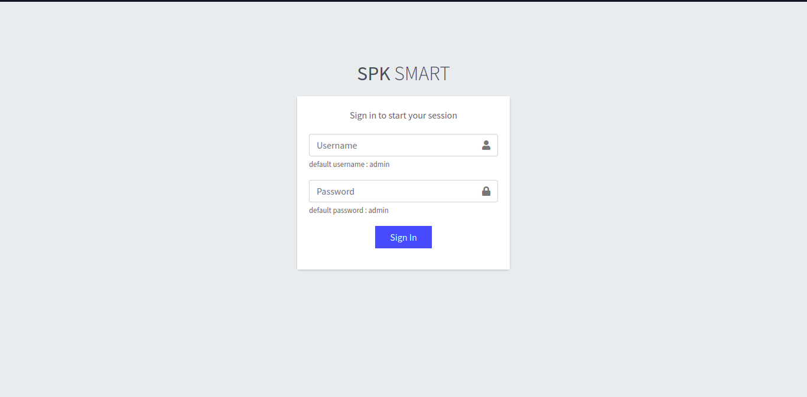
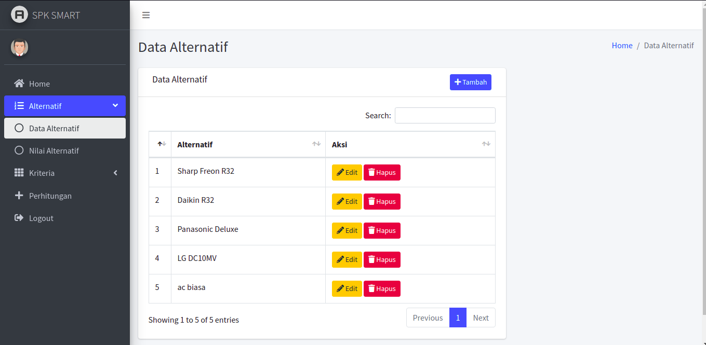
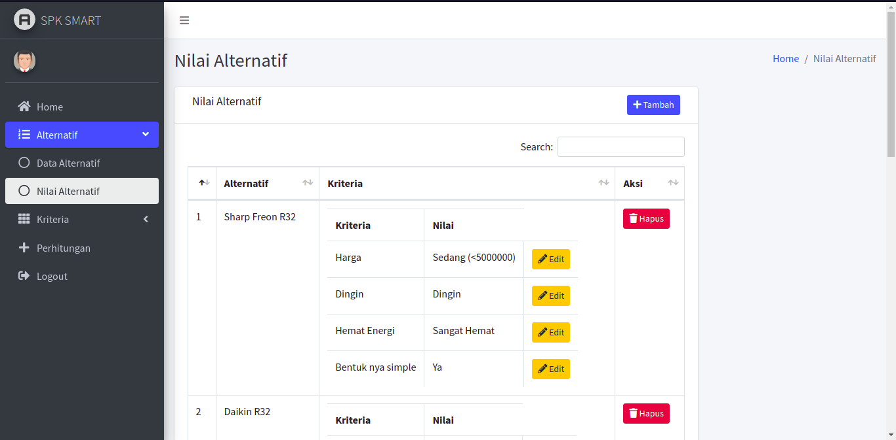
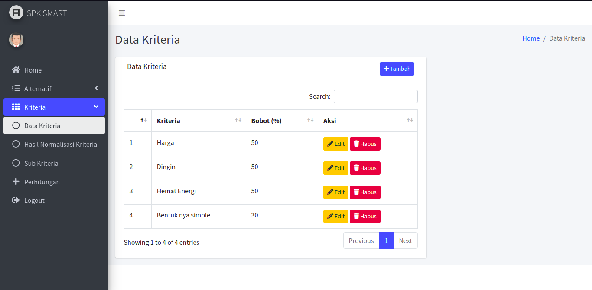
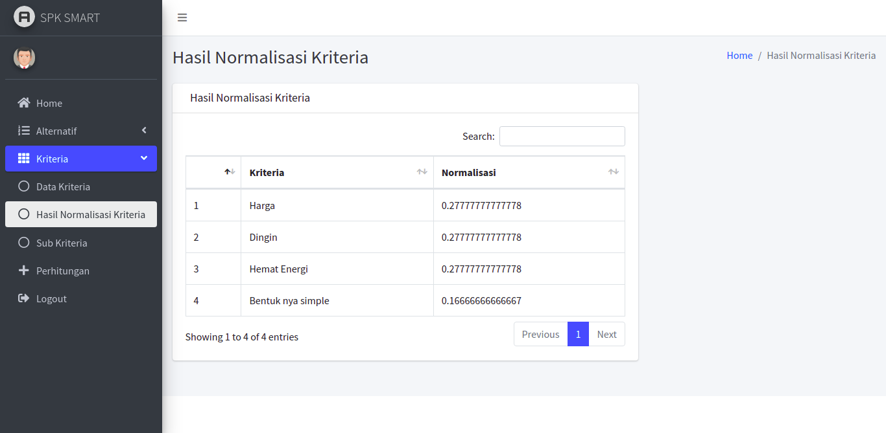
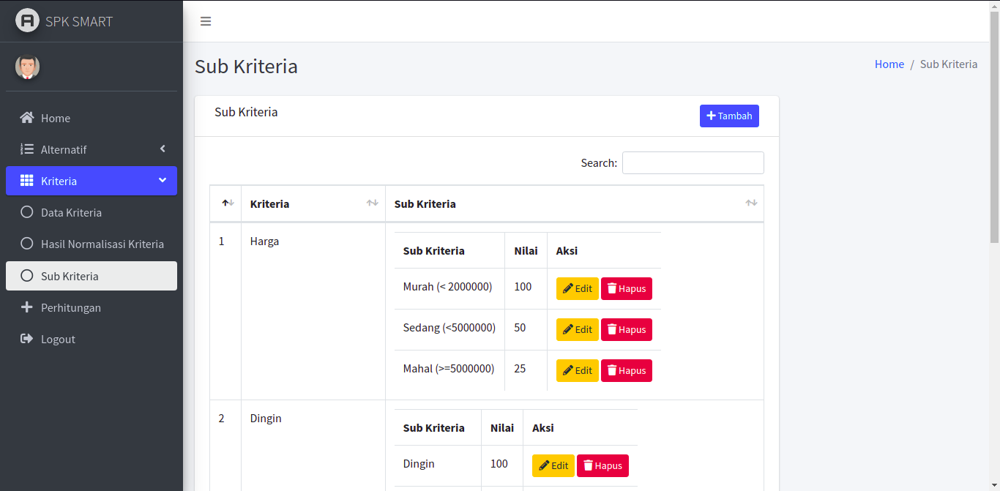

# Sistem Pendukung Keputusan Pemilihan AC dengan Metode SMART

Ini adalah aplikasi pendukung keputusan untuk pemilihan jenis AC sesuai dengan kriteria yang sudah ditentukan

Aplikasi ini dibuat dengan bahasa pemrograman PHP dan menggunakan Dashboard [AdminLTE](https://adminlte.io "AdminLTE") untuk mengelola dashboar aplikasi

## Tampilan Aplikasi

`Login`

`Alternatif`

`Nilai Alternatif`

`Kriteria`

`Normalisasi Kriteria`

`Sub Kriteria`

`Perhitungan`
